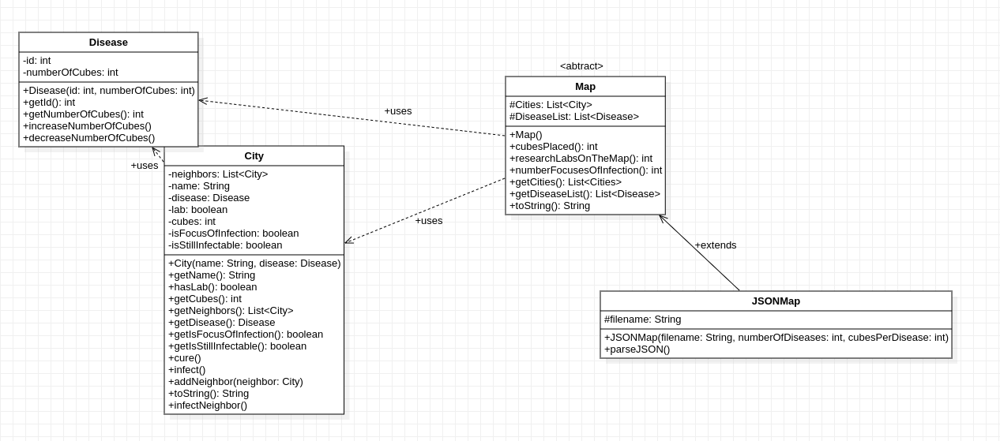
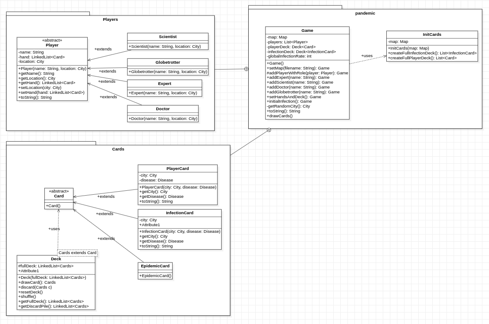
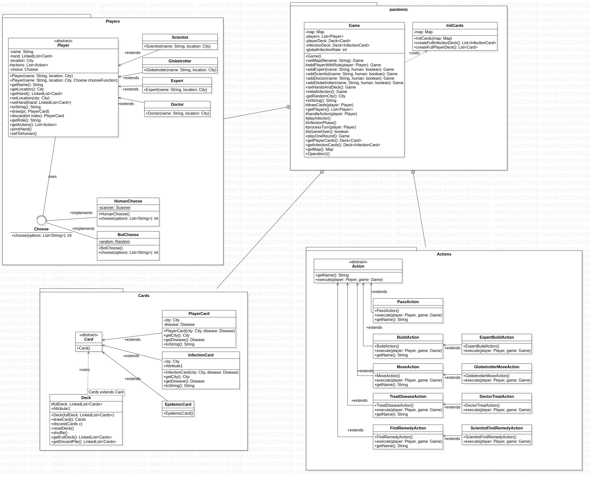

# l2s4-projet-2023

TODO ajouter desc du projet

# Equipe

- Rosa Ouarkoub
- Lylia Kannat
- Anton Rychwalski
- Nawfel Belfodil

# Sujet

[Le sujet 2023](https://www.fil.univ-lille.fr/~varre/portail/l2s4-projet/sujet2023.pdf)

# Compilation et execution :

- `make` : Compile les sources et execute la classe principale spécifiée (voir `MAIN_CLASS` dans le Makefile)
- `make classes` : Compile les sources
- `make run` : Execute la classe principale spécifiée (voir `MAIN_CLASS`) avec les arguments (voir `EXTRA_ARGS`)
- `make jar` : Créer un jar à partir des sources (et les compiles si nécéssaire)
- `make docs` : Génère la documentation des fichiers sources
- `make test` : Compile les classes de test
- `make run_test` : Lance les tests des classes trouvées dans `test_classes`
- `make jar` : Créer le jar
- `java -jar Program.jar` : lancer le jar

# Livrables

## Livrable 1 : 
La modélisation des villes et de la map a été réalisée, lors de la construction de la JSON map il faudra entrer en paramètre le nombre de maladies totales sur la map ainsi que le nombre de cubes par maladie, cela donne une certaine liberté lors de la création de la map qui va permetre l'implémentation d'une map correspondant aux choix de la personne qui souhaite créer la map et celle-ci ne sera pas limitée aux instructions de base du jeu, toutes les informations principales sont stockées dans les objets City qui sont à leur tour stockés dans une liste passée en attribut de l'objet map ce qui permettra de récuperer toutes les informations necessaires en itérant sur les elements de la liste comme je l'ai fait dans les méthodes de map qui vont permettre de récuperer des infos importantes sur l'avancement du jeu qui vont sans doute servir ( ie : le nombre de labo de recherche étant donné que celui-ci est limité).

Précisions importantes :
- dans le dossier data un fichier json additionel a été ajouté celui-ci nous sert lors de l'execution des tests de JSONMap
- Le fichier main actuel est là seulement dans le but de visualiser le résultat du parsing du fichier carte2.json, le main sera evidement modifié avec l'avancement du projet
- La branche "Anton" comporte le travail d'Anton Rychwalski, elle a été créée afin que celui-ci puisse ajouter son code au dépot sans causer de conflits sur git 
- Les instructions d'utilisation du makefile peuvent être retrouvées dans la section 'compilation et execution de ce readme'

Ci-joint le diagramme UML de ce premier livrable :


### Atteinte des objectifs :
La modélisation semble adequate mais il est possible que des modifications soient apportées avec l'avancement du projet mais pour le premier livrable le code et la modélisation actuelles me semblent appropriés aux besoins de l'énoncé.

### Difficultés restant à résoudre : 

## Livrable 2
La conceptualisation que nous avons choisie est la suivante :<br/>
une classe deck permet de structurer les decks de cartes et de les gérer elle contient des methodes permettant de par example melanger un deck ainsi que deux attribus : le deck en question et sa défausse , une classe initCards a été mise en place pour permettre l'initialisation des decks de cartes du jeu et ces deux structures sont solicitées dans la classe Game qui nous sert de builder en quelque sorte afin de créer une partie correctement initialisée, les méthodes dans Game sont par ailleurs codées de manière à pouvoir réaliser des appels chainés comme nous l'avont fait dans le main à condition d'initialiser les choses dans le bon ordres ( le code lance des exceptions sinon ). Pour la modélisation des joueurs nous avons créer une classe abstraite player dont tout les roles héritent, ainsi l'ajout des roles est rendu relativement facile : il n'y a qu'à créer une class pour le nouveau role et de faire que celle-ci hérite de player puis ajouter dans la classe game une méthode qui suit ce format :
```
public Game add{nouveauRole}(String name) { 
        this.addPlayerWithRole(new {nouveauRole}(name, getRandomCity())); 
        return this;
      } 
```
Nous avons fait de notre mieux pour respecter l'open closed principe mais des modifications sont suceptibles d'être apportées. <br/>

Précisions sur les contributions :<br/>
Uml : Lylia<br/>
choix de modelisation : Anton & Rosa<br/>
code de player + roles : Nawfel & Rosa <br/>
documentation : Nawfel <br/>
tests : Anton & Rosa<br/>
reste : Rosa<br/>

Ci-joint l'UML du deuxième livrable : 



### Atteinte des objectifs
le main actuel ajoute 4 joueurs ( un pour chaque rôle ) , initialise le deck de la partie, distribue leurs mains aux joueurs et effectue l'infection initiale conformément au sujet (cad : On tire 9 cartes infection de la pile des cartes infection préalablement mélangée :<br/>
• les 3 premières villes sont infectées par 3 cubes de la maladie figurant sur la carte,<br/>
• les 3 suivantes par 2 cubes,<br/>
• les 3 dernières par 1 cube.<br/>
Les 9 cartes infection sont défaussées. )<br/>
 ( certe le mail exigeait de faire cela avec seulement deux cartes infection mais je m'étais appuyée sur le sujet lorsque j'ai codé cette fonctionalité, my bad )<br/>
 les methodes utilisées dans la classe game s'appuient sur des methodes intermédiaires testées dans les fichiers de test. 

 Petite précision : lors de la génération des decks de cartes infections, nous avons fait en sorte qu'il n'y ait qu'une carte infection par ville, sinon lors de l'infection initiale une ville est succeptible d'être tirée plusieurs fois et c'est en remarquantn ce comportement que nous avons changé notre code, si cela n'était pas ce qui était attendu nous nous excusons d'avance!!


### Difficultés restant à résoudre

## Livrable 3
Pour ce livrable nous avons décider d'implémenter une structure permettant de gérer le choix des actions,
les structures humanChoose et botChoose comme leur nom l'indique permettent de gérer les choix d'un joueur humain où d'un bot qui executera des actions aléatoires. La raison de ce choix d'implémentation au lieu de list chooser était pour permettre plus de liberté en terme de customisation du texte de séléction alors que list chooser se base sur une méthode toString. Pour l'implémentation des actions chaque action est codée dans sa propre classe se qui facilite l'ajout de DLC ( il n'y a qu'à rajouter le fichier de la classe de la nouvelle action que l'on souhaite ajouter et la faire hériter de la classe Action)
Lancer le main vous permettera de jouer un tour en tant que joueur humain ( votre joueur s'appelle Nicki Minaj je n'avais pas d'idées d'accord ) si vous voulez jouer avec une map différente : <br>
`make MAP_FILE={classpath du fichier json de votre choix}` <br>
• veuillez noter que map4test ne sera pas adaptée ici en raison du nombre de villes trop petits qui ne permet pas de réaliser l'infection initiale car il n'y a tout simplement pas assez de villes 

Distribution des taches :
code des actions : Anton + refactoring et legers fix de la part de Rosa
test : Lylia & Rosa
readme + doc + uml : Nawfel
structures de choix : Rosa
Main + methodes additionelles de game : Rosa & Anton

Bonus : 
• nous avons créer une branche rendering où nous travaillons actuellement sur une eventuelle interface graphique avec des assets en pixelArt fait par les membres du groupe
• Test coverage disponible ` make coverage ` puis ouvrir le fichier html obtenu


Ci-joint l'UML de ce livrable : 


voici un kirby pour conclure ce livrable 

```
⠀⠀⠀⠀⠀⠀⠀⠀⠀⠀⠀⣠⣤⣤⣤⣄⣀⡀⠀⠀⠀⠀⠀⠀⠀⠀⠀
⠀⣠⡶⠒⠒⠶⣄⣠⡴⠚⠉⠁⠀⠀⠀⠀⠀⠉⠙⠳⢦⡀⠀⠀⠀⠀⠀⠀
⢠⡏⠀⠀⠀⠀⠘⠁⠀⠀⠀⠀⠀⠀⠀⠀⠀⠀⠀⠀⠀⠙⢧⡀⠀⠀⠀⠀
⢸⡄⠀⠀⠀⠀⠀⠀⠀⠀⠀⠋⢱⠀⠀⢠⠉⢡⠀⠀⠀⠀⠀⠻⡄⠀⠀⠀
⠀⣧⠀⠀⠀⠀⠀⠀⠀⠀⢸⣧⣾⠄⠀⢸⣦⣾⠀⠀⠀⠀⠀⠀⢻⡄⠀⠀
⠀⠘⢧⡀⠀⠀⠀⠀⠀⠀⠈⣿⣿⠀⠀⠸⣿⡿⠀⠀⠀⠀⠀⠀⠈⠳⣄⠀
⠀⠀⠀⡇⠀⠀⠀⠀⠀⠀⠀⠈⠁⡴⠶⡆⠉⠁⠀⠀⠀⠀⠀⠀⠀⠀⠹⡄
⠀⠀⠀⢷⠀⠀⠀⠀⠀⠀⠀⠀⠀⠐⠒⠁⠀⠀⠀⠀⠀⠀⠀⠀⠀⠀⠀⣷
⠀⠀⠀⠸⡆⠀⠀⠀⠀⠀⠀⠀⠀⠀⠀⠀⠀⠀⠀⠀⠀⠀⠀⠀⠀⠀⣠⠇
⠀⠀⠀⣀⡿⣆⠀⠀⠀⠀⠀⠀⠀⠀⠀⠀⠀⠀⠀⠀⠀⠀⢀⡽⣿⡛⠁⠀
⠀⣠⢾⣭⠀⠈⠳⣄⠀⠀⠀⠀⠀⠀⠀⠀⠀⠀⠀⠀⠀⡠⠊⠀⢠⣝⣷⡀
⢠⡏⠘⠋⠀⠀⠀⠈⠑⠦⣄⣀⠀⠀⠀⠀⠀⣀⡠⠔⠋⠀⠀⠀⠈⠛⠃⢻
⠈⠷⣤⣀⣀⣀⣀⣀⣀⣀⣀⣤⡽⠟⠛⠿⣭⣄⣀⣀⣀⣀⣀⣀⣀⣀⣤⠞
⠀⠀⠀⠀⠉⠉⠉⠉⠉⠉⠁⠀⠀⠀⠀⠀⠀⠀⠈⠉⠉⠉⠉⠉⠉⠀⠀⠀⠀⠀⠀⠀⠀⠀⠀⠀⠀⠀⠀⠀⠀⠀⠀⠀⠀⠀⠀⠀
```
### Atteinte des objectifs

### Difficultés restant à résoudre

## Livrable 4
Le projet a été complété, le jeu devrait fonctionner correctement! 

afin de conclure ce projet voici un bull terrier! 


### Atteinte des objectifs

### Difficultés restant à résoudre

# Journal de bord

## Semaine 1

La première semaine a majoritairement porté sur l'UML ainsi que le début de code des classes avec les méthodes basiques ( getter & constructeurs )

## Semaine 2

Plusieurs rectifications et modifications ont été apportés à l'UML de départ, le code du parseur JSON a été entamé

## Semaine 3

L'implementation du parseur a été terminée, ainsi que d'un fichier main permettant d'afficher le résultat du parsing sur les données du fichier carte2.json. Les classes de tests ont été ajoutées ainsi qu'un fichier makefile qui facilitera l'exécution de nos fichiers et l'observation de leur résultats

## Semaine 4

L'UML de Player a été fait ainsi que son code, commencement de celle de cartes et de son code.

## Semaine 5

Modification du code Player et de son UML<br/>
Code de cartes fini et commencement de son UML<br/>
Création des 4 rôles différents en extends de Player<br/>

## Semaine 6

Tri des fichiers<br/>
Création d'une classe Game<br/>
Continution de la classe Player et modification de son UML<br/>

## Semaine 7

Finalisation du travail pour le livrable 2

## Semaine 8
code des classes correspondant aux actions

## Semaine 9
code des structures de choix botchoose + humanchoose

## Semaine 10
code du main et ajout de méthode dans la classe game 
finalisation de l'uml + test & doc

## Semaine 11

## Semaine 12
